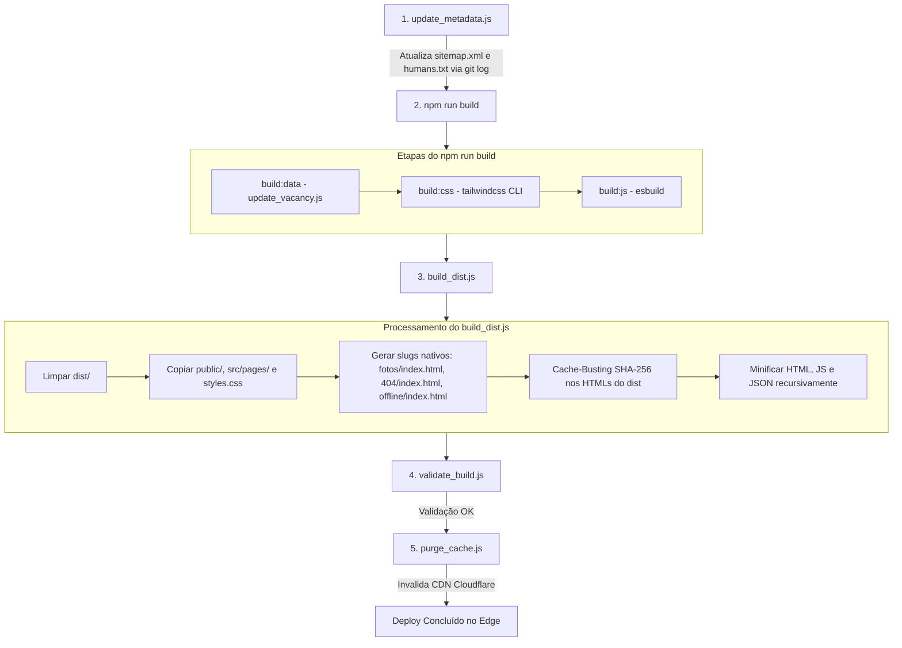

# Guia de Desenvolvimento & Arquitetura — República Santo Grau

Este documento é a referência técnica unificada, detalhada e oficial do projeto **República Santo Grau**. Ele cobre toda a arquitetura, pilha de tecnologias, estrutura de diretórios, pipeline de compilação, automações, hospedagem na Cloudflare Pages e instruções para desenvolvimento e manutenção.

---

## 1. Visão Geral do Projeto

O site da **República Santo Grau** é uma plataforma web estática de ultra-alta performance, desenvolvida com foco em velocidade, acessibilidade (a11y), SEO técnico avançado e baixo custo de manutenção.

### Princípios de Engenharia

- **Zero Heavy Frameworks**: Sem React, Vue, Angular ou Svelte. Adotamos HTML5 semântico, JavaScript ES2022+ nativo e Tailwind CSS v4. Isso elimina overhead de bundle, garante TTI (Time to Interactive) instantâneo e elimina vulnerabilidades em cascata.
- **Static-First com SSG-Lite**: Dados dinâmicos (vagas, comodidades, avaliações do Google e datas de modificação SEO) são compilados e injetados em tempo de build via scripts Node.js e automações Python. O resultado entregue ao usuário final é 100% estático.
- **Hospedagem Edge-Native (Cloudflare Pages)**: Servido diretamente na borda global da Cloudflare, com roteamento de URLs limpas nativo (`/fotos/`, `/404/`), Edge Middleware (`functions/_middleware.js`) e invalidação de cache via API.
- **Sem Service Worker**: A entrega de conteúdo é direta e ultrarrápida via CDN edge-cached da Cloudflare com Cache-Busting via hash SHA-256 e Early Hints (HTTP 103).

---

## 2. Stack Tecnológico

| Camada / Função          | Tecnologia                                   | Detalhes / Versão                                                       |
| :----------------------- | :------------------------------------------- | :---------------------------------------------------------------------- |
| **Frontend Core**        | HTML5 Semântico, JS ES2022+                  | Estrutura modular, Vanilla JS sem dependências                          |
| **Estilização**          | Tailwind CSS v4 (`@tailwindcss/cli`)         | Compilador de utilitários CSS de alta velocidade                        |
| **Tipografia Local**     | Google Fonts (Montserrat & Playfair Display) | Self-hosted em formato WOFF2 com preload e Early Hints                  |
| **JS Bundling / Minify** | `esbuild` v0.28+                             | Minificação instantânea (~3ms) para `script.min.js`                     |
| **HTML / JSON Minify**   | `html-minifier-terser` v7.2                  | Compressão agressiva de HTML e JSON                                     |
| **Edge Middleware**      | Cloudflare Pages Functions                   | `functions/_middleware.js` (Redirecionamento Canônico + Early Hints)    |
| **Servidor Local**       | `http-server`                                | Teste e preview local do `/dist` na porta 3000                          |
| **Automação de SEO**     | Node.js nativo (`update_metadata.js`)        | Atualização automática do `sitemap.xml` e `humans.txt` via `git log`    |
| **Automação Google**     | Python 3.12 (`rating_update.py`)             | Consulta semanal via GitHub Actions à Google Places API                 |
| **Validação de Build**   | Node.js (`validate_build.js`)                | Teste de integridade de arquivos e verificação de integridade pós-build |
| **Limpeza de Cache**     | Node.js (`purge_cache.js` + Fetch API)       | Invalidação de cache CDN após deploy                                    |
| **Linter & Formatação**  | ESLint 10, Prettier 3.8                      | Padronização e qualidade de código                                      |

---

## 3. Estrutura de Diretórios

```
repsantograu/
├── .github/
│   └── workflows/
│       └── rating_update.yml              # Automação semanal de avaliações Google Places
├── docs/
│   ├── Dev_Guide.md                       # Guia de desenvolvimento unificado (este arquivo)
│   └── divulgacao_rep/                    # Material gráfico e textos de divulgação
├── functions/
│   └── _middleware.js                     # Edge Middleware do Cloudflare Pages (Canonical 301 + Early Hints)
├── public/                                # Arquivos estáticos copiados diretamente para o dist
│   ├── .well-known/                       # security.txt e verificações de domínio
│   ├── _headers                           # Headers HTTP (CSP, HSTS, Permissions-Policy, Cache-Control)
│   ├── _redirects                         # Redirecionamentos estáticos (ex: /index.html -> /)
│   ├── fonts/                             # Fontes locais em WOFF2
│   ├── icons/                             # Favicons, apple-touch-icon e ícones
│   ├── imagens/                           # Imagens da galeria e estrutura otimizadas em WebP/JPG
│   ├── favicon.ico / favicon-*.png        # Ícones legados de compatibilidade
│   ├── humans.txt                         # Créditos da equipe e data da última atualização
│   ├── llms.txt                           # Documentação contextual para crawlers de IA
│   ├── manifest.json                      # Web App Manifest
│   ├── robots.txt                         # Regras para motores de busca
│   └── sitemap.xml                        # Sitemap XML dinâmico
├── scripts/
│   ├── automation/
│   │   ├── rating_update.py               # Script Python para sincronizar notas do Google Maps
│   │   ├── requirements.txt               # Dependências Python (requests, beautifulsoup4)
│   │   └── update_metadata.js             # Atualizador de sitemap.xml e humans.txt via git log
│   └── build/
│       ├── build_dist.js                  # Orquestrador mestre de build, cópia e minificação
│       ├── purge_cache.js                 # Invalidador de cache na API da Cloudflare
│       ├── update_vacancy.js              # Injetor de dados de vagas, comodidades e JSON-LD
│       └── validate_build.js              # Validador de integridade e arquivos do dist
├── src/
│   ├── data/
│   │   ├── amenities.json                 # Comodidades da casa e paths dos ícones SVG
│   │   └── vagas.json                     # Dados de vagas (ano, total, ocupadas, tipo de quarto)
│   ├── js/
│   │   ├── script.js                      # Código-fonte JavaScript principal
│   │   └── script.min.js                  # Versão compilada/minificada por esbuild
│   ├── pages/
│   │   ├── 404.html                       # Página 404 personalizada
│   │   ├── fotos.html                     # Galeria completa com Lightbox e Zoom
│   │   ├── index.html                     # Página principal
│   │   └── offline.html                   # Página de fallback sem conexão
│   └── styles/
│       └── input.css                      # CSS fonte do Tailwind v4 com fontes locais e animações
├── dist/                                  # Diretório compilado final (deployado no Cloudflare Pages)
├── eslint.config.js                       # Configuração do ESLint v10
├── package.json / package-lock.json       # Dependências e scripts npm
└── styles.css                             # CSS compilado e minificado pelo Tailwind
```

---

## 4. Pipeline de Compilação & Build (`npm run build:dist`)

O comando `npm run build:dist` executa uma cadeia completa e sequencial de build, validação e purga de cache:



### Detalhes das Etapas:

1. **`node scripts/automation/update_metadata.js`**:
   - Lê o commit mais recente de cada arquivo mapeado via `git log -1 --format=%cd --date=short`.
   - Atualiza as tags `<lastmod>` no `public/sitemap.xml`.
   - Atualiza a data `Last update:` no `public/humans.txt`.

2. **`npm run build:data` (`scripts/build/update_vacancy.js`)**:
   - Lê `src/data/vagas.json` e `src/data/amenities.json`.
   - Injeta o badge visual de vagas (com suporte a singular/plural e cores por nível de ocupação).
   - Injeta a lista de comodidades no `#amenities-container`.
   - Atualiza o Schema JSON-LD (`LocalBusiness`) e os textos do FAQ em `src/pages/index.html`.

3. **`npm run build:css`**:
   - Compila `src/styles/input.css` usando `@tailwindcss/cli` em modo `--minify`, gerando `styles.css`.

4. **`npm run build:js`**:
   - Minifica `src/js/script.js` com `esbuild` para ES2022, gerando `src/js/script.min.js`.

5. **`node scripts/build/build_dist.js`**:
   - Limpa e recria a pasta `dist/`.
   - Copia todos os arquivos estáticos e subpastas de `public/`, páginas de `src/pages/` e `styles.css`.
   - Cria cópias das páginas em subdiretórios slug (`dist/fotos/index.html`, `dist/404/index.html`, `dist/offline/index.html`) para suporte nativo a trailing slash sem loops de redirecionamento no Cloudflare Pages.
   - Aplica **Cache-Busting SHA-256** anexando `?v=<hash>` em links e scripts nos arquivos HTML dentro de `dist/`. Fontes `.woff2` e URLs externas são preservadas.
   - Minifica recursivamente arquivos HTML, JS e JSON em `dist/`.

6. **`node scripts/build/validate_build.js`**:
   - Executa testes de integridade verificando a presença de todos os arquivos obrigatórios em `dist/`.
   - Garante que nenhum arquivo residual (`.log`, `.map`, `.tmp` ou `sw.js`) esteja presente na pasta de produção.

7. **`node scripts/build/purge_cache.js`**:
   - Se as variáveis `CLOUDFLARE_ZONE_ID` e `CLOUDFLARE_API_TOKEN` estiverem presentes no ambiente, envia uma requisição `POST` para purgar todo o cache da CDN Cloudflare.

---

## 5. Cloudflare Pages, Edge Functions & Segurança

### 1. Edge Middleware (`functions/_middleware.js`)

O arquivo `functions/_middleware.js` é executado na borda da Cloudflare a cada requisição:

- **Redirecionamento Canônico (301)**: Qualquer acesso vindo de `*.pages.dev` é imediatamente redirecionado para `www.repsantograu.online`.
- **Early Hints (HTTP 103)**: Em respostas `text/html`, injeta cabeçalhos `Link` com `rel=preload` para as fontes críticas (`Montserrat` e `Playfair Display`), acelerando o carregamento antes do download do HTML completo.

### 2. Cabeçalhos HTTP (`public/_headers`)

- **Content-Security-Policy (CSP)**: Diretivas rigorosas permitindo apenas o domínio local, Cloudflare Insights e SDK do Facebook.
- **Strict-Transport-Security (HSTS)**: `max-age=31536000; includeSubDomains`.
- **Permissions-Policy**: Desativa APIs de câmera, microfone, geolocalização e pagamentos.
- **Cache-Control por tipo**:
  - Imagens, CSS, JS, Fontes (`*.woff2`, `*.webp`, `*.png`, etc.): `public, max-age=31536000, immutable`.
  - HTML, XML, TXT (`*.html`, `*.xml`, `*.txt`): `public, max-age=0, must-revalidate`.

### 3. Redirecionamentos (`public/_redirects`)

- `/index.html` ➔ `/` (HTTP 301)

---

## 6. Como Fazer Alterações no Site

### Atualizar Vagas da República

Abra o arquivo [`src/data/vagas.json`](file:///home/vaugusto/Desktop/repsantograu/src/data/vagas.json) e edite os campos:

```json
{
  "year": "2026.2",
  "total_slots": 1,
  "occupied_slots": 0,
  "room_type": "Quarto Compartilhado"
}
```

Na próxima execução de `npm run build` ou `npm run build:dist`, a badge visual, os textos do FAQ e o schema JSON-LD serão atualizados automaticamente.

### Atualizar Comodidades / Benefícios

Edite o arquivo [`src/data/amenities.json`](file:///home/vaugusto/Desktop/repsantograu/src/data/amenities.json). Cada entrada possui o path SVG do ícone e o texto em HTML.

### Adicionar Fotos / Otimização de Imagens

- **Formato recomendado**: WebP para imagens gerais e thumbnails.
- **Tamanho máximo por arquivo**: **24 MB** (o Cloudflare Pages possui limite estrito de 25 MB por arquivo no upload).
- **Imagens com Zoom de Alta Resolução**: Mantenha uma thumbnail para a grade e aponte o atributo `data-full` da tag `` para a imagem de alta definição.

### Alterar Estilos e CSS

- Use as classes utilitárias do Tailwind diretamente no HTML.
- Para estilos globais ou componentes reutilizáveis, edite [`src/styles/input.css`](file:///home/vaugusto/Desktop/repsantograu/src/styles/input.css).

### Alterar Comportamento JavaScript

- Edite [`src/js/script.js`](file:///home/vaugusto/Desktop/repsantograu/src/js/script.js).
- O arquivo minificado `src/js/script.min.js` será gerado automaticamente via `npm run build:js` com `esbuild`.

---

## 7. Comandos do Desenvolvedor (NPM Scripts)

| Comando                          | Descrição                                                                                                      |
| :------------------------------- | :------------------------------------------------------------------------------------------------------------- |
| `npm run dev`                    | Inicia o watcher do Tailwind CSS para desenvolvimento local                                                    |
| `npm run preview` ou `npm start` | Inicia servidor HTTP local (`http-server`) servindo o `/dist` em `http://localhost:3000`                       |
| `npm run build`                  | Compila dados (`vagas.json`), CSS (Tailwind) e JS (`esbuild`)                                                  |
| `npm run build:dist`             | Executa o pipeline de distribuição completo (metadados, build, empacotamento dist, validação e purga de cache) |
| `npm run test:build`             | Executa a validação de integridade de arquivos do `/dist`                                                      |
| `npm run purge:cache`            | Executa a purga manual do cache no Cloudflare                                                                  |
| `npm run format`                 | Formata todo o código com Prettier                                                                             |
| `npm run format:check`           | Verifica se os arquivos estão formatados                                                                       |
| `npm run lint`                   | Executa análise estática com ESLint                                                                            |
| `npm run lint:fix`               | Corrige problemas automáticos com ESLint                                                                       |

---

## 8. Variáveis de Ambiente (Cloudflare Pages)

No painel do Cloudflare Pages (Settings ➔ Environment variables), configure as seguintes variáveis para automação completa do cache:

| Variável               | Tipo        | Descrição                                                |
| :--------------------- | :---------- | :------------------------------------------------------- |
| `CLOUDFLARE_ZONE_ID`   | Plain text  | ID da zona DNS da República Santo Grau                   |
| `CLOUDFLARE_API_TOKEN` | Secret text | Token de API Cloudflare com permissão `Zone.Cache Purge` |

---

_Documentação oficial da República Santo Grau. Atualizada em Agosto de 2026._
