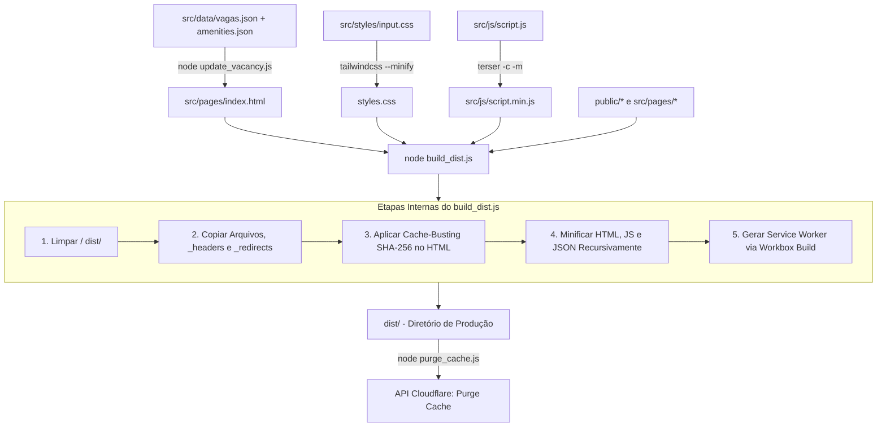

# Arquitetura e Engenharia de Software — República Santo Grau

Este documento detalha exaustivamente a arquitetura, estrutura de arquivos, pipelines de build, automações CI/CD, hospedagem, DNS, configurações de segurança, PWA e estratégias de frontend do projeto **República Santo Grau**.

---

## 1. Visão Geral do Sistema

O site da **República Santo Grau** é uma plataforma web estática de ultra-alta performance projetada sob a forma de uma **Single Page Application (SPA)** e **Progressive Web App (PWA)**.

### Princípios de Design e Engenharia

- **Zero Heavy Frameworks**: Sem React, Vue, Angular ou Svelte. O projeto adota HTML5 semântico, JavaScript ES6+ Vanilla e Tailwind CSS v4. Isso elimina overhead de bundle, minimiza o tempo de inicialização (TTI) e reduz drasticamente a superfície de vulnerabilidades.
- **Static-First com SSG-Lite**: O conteúdo dinâmico (vagas, comodidades, avaliações do Google Maps e metadados SEO) é processado e injetado em tempo de build/automação via scripts Node.js e Python, mantendo a entrega 100% estática para os usuários finais.
- **Resiliência e Funcionamento Offline**: Suporte completo a PWA com estratégias de cache via Service Worker (Workbox) e fallback gracioso em caso de queda de conexão.
- **Hospedagem Native Edge (Cloudflare Pages)**: Servido diretamente da infraestrutura global da Cloudflare, garantindo latência ultra-baixa, SSL nativo, e purga de cache automática/via script no deploy.

---

## 2. Stack Tecnológico

| Camada / Responsabilidade  | Tecnologia / Ferramenta                      | Descrição / Detalhes                                                                          |
| :------------------------- | :------------------------------------------- | :-------------------------------------------------------------------------------------------- |
| **Frontend Core**          | HTML5 Semântico, JS ES6+ (Vanilla)           | Estrutura acessível, manipulada por scripts nativos leves.                                    |
| **Estilização**            | Tailwind CSS v4.3.0 (`@tailwindcss/cli`)     | Motor de utilitários CSS compilado em tempo de build.                                         |
| **Tipografia Local**       | Google Fonts (Montserrat & Playfair Display) | Fontes self-hosted em formato WOFF2 com versionamento de cache.                               |
| **PWA / Service Worker**   | Workbox v7.4.1 (`workbox-build`)             | Geração automatizada do `sw.js` com precache e runtime caching.                               |
| **Minificação & Bundling** | Terser v5.47, html-minifier-terser v7.2      | Compressão agressiva de JS, HTML e JSON no pipeline de distribuição.                          |
| **Automação & SEO**        | Python 3.12 (Requests, BeautifulSoup4, Lxml) | Bots acionados por cron no GitHub Actions para atualização de nota Google Places e Sitemap.   |
| **Hospedagem & CI/CD**     | Cloudflare Pages                             | Build e hospedagem direta no Edge do Cloudflare executando `npm run build:dist`.              |
| **Limpeza de Cache**       | Node.js (`purge_cache.js` + Fetch API)       | Script nativo invocado ao final do `build:dist` para invalidar o cache no Edge da Cloudflare. |
| **Qualidade de Código**    | ESLint 10, Prettier 3.8                      | Padronização e análise estática de código.                                                    |

---

## 3. Mapeamento da Estrutura de Diretórios

```
repsantograu/
├── .github/
│   └── workflows/
│       ├── lastmod_update.yml                             # Automação diária de Sitemap e humans.txt
│       └── rating_update.yml                              # Automação semanal de avaliações Google Places
├── docs/
│   ├── ai_developer_guide.md                              # Contexto interno para assistentes de IA
│   └── architecture.md                                    # Documentação oficial de arquitetura (este arquivo)
├── public/                                                # Ativos estáticos copiados diretamente no build
│   ├── .well-known/                                       # security.txt e verificações de domínio
│   ├── _headers                                           # Regras de segurança (CSP, HSTS, Permissions-Policy) e Caching do Cloudflare Pages
│   ├── _redirects                                         # Regras de redirecionamento 301 para URLs limpas no Cloudflare Pages
│   ├── fonts/                                             # Arquivos WOFF2 de Montserrat e Playfair Display
│   ├── icons/                                             # Favicons e ícones PWA
│   ├── imagens/                                           # Fotos da galeria e estrutura otimizadas (WebP)
│   ├── favicon.ico / favicon-*.png                        # Favicons legados
│   ├── humans.txt                                         # Créditos e data de última atualização
│   ├── llms.txt                                           # Contexto resumido para crawlers de IA
│   ├── manifest.json                                      # Manifesto de aplicação Web (PWA)
│   ├── robots.txt                                         # Instruções para indexadores de busca
│   └── sitemap.xml                                        # Mapa XML do site para SEO
├── scripts/
│   ├── automation/
│   │   ├── lastmod_update.py                              # Script Python para atualizar lastmod do sitemap
│   │   ├── rating_update.py                               # Script Python para consultar Google Places API
│   │   └── requirements.txt                               # Dependências Python (requests, beautifulsoup4, lxml)
│   └── build/
│       ├── build_dist.js                                  # Script mestre de empacotamento, cache-busting e Workbox
│       ├── purge_cache.js                                 # Script de invalidação de cache na API da Cloudflare
│       └── update_vacancy.js                              # Injetor de dados de vagas, comodidades e JSON-LD
├── src/
│   ├── data/
│   │   ├── amenities.json                                 # Lista e SVG paths das comodidades oferecidas
│   │   └── vagas.json                                     # Estado atual de vagas (ano, total, ocupadas, tipo)
│   ├── js/
│   │   ├── script.js                                      # Código-fonte principal de interatividade no cliente
│   │   └── script.min.js                                  # Versão minificada gerada no build
│   ├── pages/
│   │   ├── 404.html                                       # Página de erro 404 customizada
│   │   ├── fotos.html                                     # Galeria completa de fotos com Lightbox
│   │   ├── index.html                                     # Landing page principal (SPA)
│   │   └── offline.html                                   # Página exibida sem conexão de rede (PWA Fallback)
│   └── styles/
│       └── input.css                                      # Entrada principal do Tailwind v4 com fontes e animações
├── .gitignore                                             # Arquivos ignorados pelo Git
├── .prettierignore / .prettierrc                          # Regras de formatação Prettier
├── eslint.config.js                                       # Regras de linter ESLint v10
├── package.json / package-lock.json                       # Dependências e scripts do projeto Node.js
└── styles.css                                             # CSS minificado/gerado pelo Tailwind CSS v4
```

---

## 4. Arquitetura de Build e Empacotamento

O ciclo de build transforma o código-fonte em um pacote de produção no diretório efêmero `dist/`.

### Diagrama do Fluxo de Build (`npm run build:dist`)



### Detalhamento dos Scripts de Build

#### 1. Injeção de Vagas e Comodidades (`scripts/build/update_vacancy.js`)

- Executado via `npm run build:data`.
- Lógica de Vagas: Lê `src/data/vagas.json`, calcula vagas disponíveis (`total_slots - occupied_slots`) e ajusta a badge de disponibilidade visual (verde, laranja, vermelho ou cinza).
- Atualização de FAQ, Comodidades e Schema JSON-LD.

#### 2. Minificação e Compilação CSS/JS

- `build:css`: Compila `src/styles/input.css` usando `@tailwindcss/cli` em modo minificado gerando `styles.css`.
- `build:js`: Minifica `src/js/script.js` usando `terser` gerando `src/js/script.min.js`.

#### 3. Orquestrador de Empacotamento (`scripts/build/build_dist.js`)

- Copia arquivos de `public/` (incluindo `_headers` e `_redirects`), páginas HTML, ativos estáticos e CSS compilado.
- Aplica **Cache-Busting SHA-256** anexando `?v=<hash>` nos arquivos HTML dentro da pasta `dist/`.
- Minifica arquivos HTML, JS e JSON.
- Gera o Service Worker (`dist/sw.js`) via `workbox-build`.

#### 4. Invalidação de Cache (`scripts/build/purge_cache.js`)

- Executado ao final do `npm run build:dist`.
- Lê as variáveis de ambiente `CLOUDFLARE_ZONE_ID` e `CLOUDFLARE_API_TOKEN`.
- Realiza uma chamada HTTP POST à API REST do Cloudflare para invalidar o cache em borda (`purge_everything: true`).

---

## 5. Configurações de Hospedagem, DNS & Segurança no Cloudflare Pages

O projeto é hospedado inteiramente no **Cloudflare Pages**.

### 1. Regras de Segurança e Caching (`public/_headers`)

Definido via arquivo estático nativo do Cloudflare Pages:

- **`Content-Security-Policy`**: Restringe execução de scripts apenas ao próprio domínio, Cloudflare Insights e SDK do Facebook.
- **`Strict-Transport-Security`**: `max-age=31536000; includeSubDomains`.
- **`Permissions-Policy`**: Desativa câmeras, microfones, geolocalização e pagamentos.
- **`Cache-Control por Extensão`**:
  - CSS, JS, Imagens, Fontes, Ícones: `public, max-age=31536000, immutable`.
  - HTML, XML, TXT: `public, max-age=0, must-revalidate`.
  - Service Worker (`/sw.js`): `no-cache, no-store, must-revalidate`.

### 2. Regras de Redirecionamento (`public/_redirects`)

- `/index.html` ➔ `/` (HTTP 301)
- `/fotos.html` ➔ `/fotos/` (HTTP 301)
- `/offline.html` ➔ `/offline/` (HTTP 301)
- `/404.html` ➔ `/404/` (HTTP 301)

---

## 6. Procedimento de Validação e Qualidade

Para testar o build completo e a purga de cache localmente:

```bash
# 1. Instalar dependências (se necessário)
npm install

# 2. Executar linter e formatação
npm run lint:fix
npm run format

# 3. Gerar o pacote de distribuição e rodar o purge_cache
npm run build:dist
```

---

_Documento mantido pela equipe de desenvolvimento da República Santo Grau. Última atualização: 2026._
